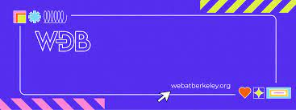

## Table of Contents:

This repository is a compilation of links to help developers build their web application

> *What I cannot create, I do not understand — Richard Feynman.*

# Table of Contents

* [UI Libraries and Components](#ui-libraries-and-components)
* [CSS](#css)
* [Design](#design)
* [AI](#ai)
* [Backend tools](#backend-tools)
* [Frameworks](#frameworks)
* [Deployment Tools](#deployment-tools)

## UI Libraries and Components
| Name    | Link | Notes |
| ------- | ---- | ----- |
| Chakra UI | https://chakra-ui.com | Customizable, accessible React component library for modern web apps.|
|Material-UI | https://mui.com/ | Open-source React component library that implements Google's Material Design.
| Ant Design | https://ant.design | A design system with values of Nature and Determinacy for better user experience of enterprise applications. |
|shadcn/ui| https://ui.shadcn.com/ | Collection of re-usable components that you can copy and paste into your apps.|
| Radix UI | https://radix-ui.com/ | Collection of open source UI components for building high-quality, accessible design systems and web apps.|
| Semantic-UI       | https://semantic-ui.com| UI component framework based around natural language principles|
| Shards-UI         | https://designrevision.com/shards| Free and modern Bootstrap 4 UI toolkit.|
| Muuri| https://muuri.dev| Responsive, sortable, filterable, and draggable grid layouts.|
| Sandpack| https://sandpack.codesandbox.io/docs| Sandpack is a component toolkit for creating live-running code editing experiences, powered by the online bundler used on CodeSandbox.|

## CSS
| Name    | Link | Notes |
| ------- | ---- | ----- |
|Drop-In CSS Generator| https://www.dropincss.com | Tool to generate custom classless CSS style sheets based on Water.css|
| CSS Grid | https://css-tricks.com/snippets/css/complete-guide-grid/ | CSS Grid Layout excels at dividing a page into major regions or defining the relationship in terms of size, position, and layer, between parts of a control built from HTML primitives. |
| Tailwind CSS | https://tailwindcss.com | Utility-first CSS framework for rapid UI development. |
| Bulma| https://bulma.io | Modern CSS framework based on Flexbox.|
| ConciseCSS| https://concisecss.github.io| Lightweight and easy-to-use CSS framework.|
| MaterializeCSS|https://materializecss.com| CSS framework based on Material Design.|
| Purgecss | https://purgecss.com | Tool to remove unused CSS from your project. |
| Bojler | https://bojler.email | CSS framework specifically designed for creating responsive emails. |

## Design
| Name    | Link | Notes |
| ------- | ---- | ----- |
| Carbon | https://github.com/carbon-app/carbon | Create and share beautiful images of your source code.|
| Snappify | https://snappify.io | Create beautiful screenshots of your code.|

## AI
| Name    | Link | Notes |
| ------- | ---- | ----- |
| Teachable Machine | https://teachablemachine.withgoogle.com | Teachable Machine is a web-based tool that makes creating machine learning models fast, easy, and accessible to everyone. |
| Vocode | https://vocode.ai | open-source library for building voice-based LLM applications.|
| Clipdrop | https://clipdrop.co | Use AI to integrate state of the art image processing directly in your products.|
| RunwayML | https://runwayml.com | RunwayML is a toolkit that makes it easy to use machine learning models in creative ways.|
| Hugging Face | https://huggingface.co | Build, train and deploy state of the art models powered by the reference open source in machine learning.|

## Backend tools
| Name | Link | Description |
| ---- | ---- | ----------- |
| Postman | https://www.postman.com | Platform for API development. |
| JSON-server | https://github.com/typicode/json-server | Tool to quickly create a fake REST API with zero coding. |
| Axios | https://github.com/axios/axios | Promise-based HTTP client for the browser and Node.js. |
| Nodemon | https://nodemon.io | Tool to monitor and automatically restart your Node.js application when changes occur. Perfect for development. |

## Frameworks
| Name | Link | Description |
| ---- | ---- | ----------- |
| Express | https://expressjs.com| Fast, unopinionated, minimalist web framework for Node.js. |
| Django | https://www.djangoproject.com | High-level Python web framework that follows the model-view-controller (MVC) architectural pattern. |
| Ruby on Rails | https://rubyonrails.org | A server-side web application framework written in Ruby that follows the model-view-controller (MVC) architectural pattern. |
| Flask | https://flask.palletsprojects.com | Lightweight web framework written in Python. It is designed to be easy to use and flexible. |
| ASP.NET Core | https://dotnet.microsoft.com/apps/aspnet | Open-source web framework for building modern web applications with .NET. |
| Laravel | https://laravel.com | PHP web framework that follows the model-view-controller (MVC) architectural pattern. |
| Next.js | https://nextjs.org | React framework for building server-side rendered and static websites. |
| Nuxt.js | https://nuxtjs.org | Vue framework for building server-side rendered and static websites. |

## Deployment Tools
| Name | Link | Description |
| ---- | ---- | ----------- |
| Heroku | https://www.heroku.com | Cloud platform that enables easy deployment, scaling, and management of applications. Supports multiple programming languages. |
| Netlify | https://www.netlify.com | All-in-one platform for deploying modern websites and applications. Offers features like continuous deployment, serverless functions, and CDN. |
| Vercel | https://vercel.com | Cloud platform for static site hosting and serverless functions. Seamlessly integrates with frameworks like Next.js. |
| AWS Elastic Beanstalk | https://aws.amazon.com/elasticbeanstalk | Fully managed service for deploying and scaling web applications. Supports various programming languages and frameworks. |
| Google Cloud Platform (GCP) | https://cloud.google.com | Suite of cloud computing services for deploying and managing applications. Provides various deployment options and services. |
| DigitalOcean App Platform | https://www.digitalocean.com/products/app-platform | Platform for deploying, managing, and scaling applications with a focus on simplicity. Supports multiple programming languages and frameworks. |

## We love our contributors ❤️❤️
Make a [pull request](https://github.com/susam/gitpr#create-pull-request) to help contribute.
 
 
<b> Contributors: </b>
 
 

 
Made with [contrib.rocks](https://contrib.rocks).

